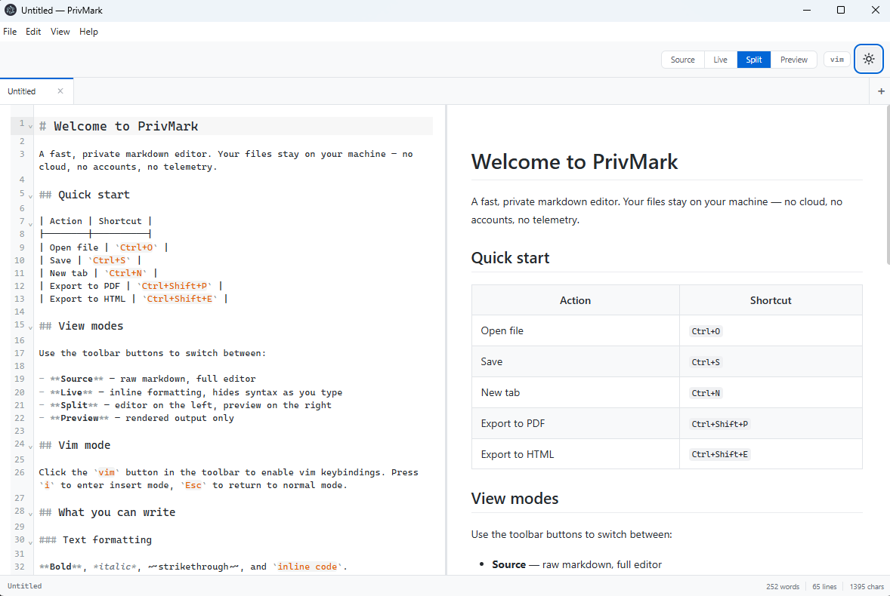
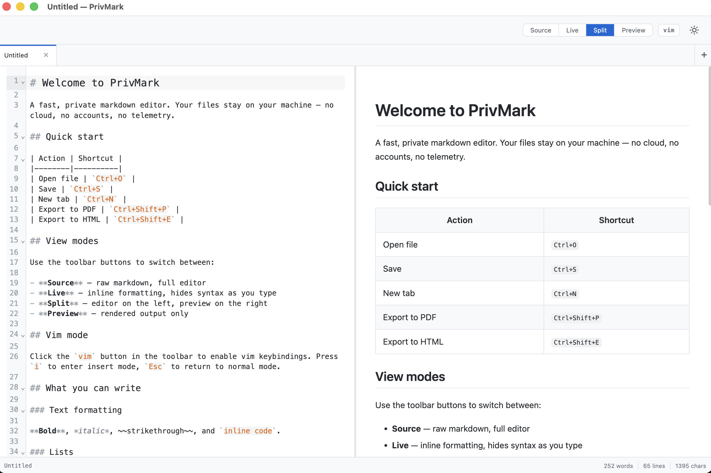
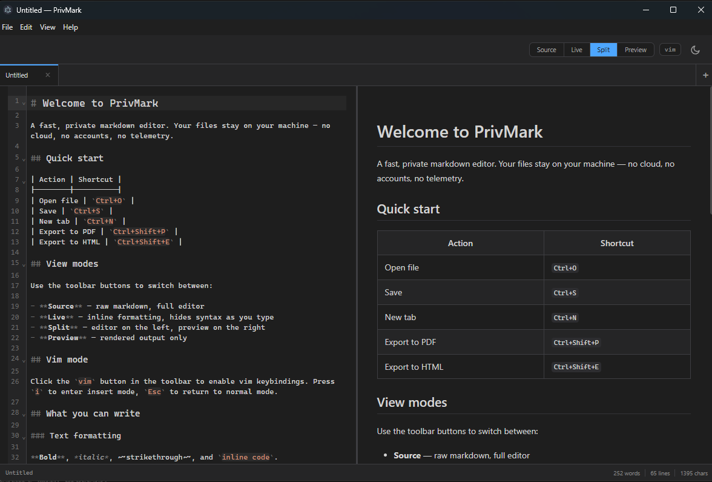
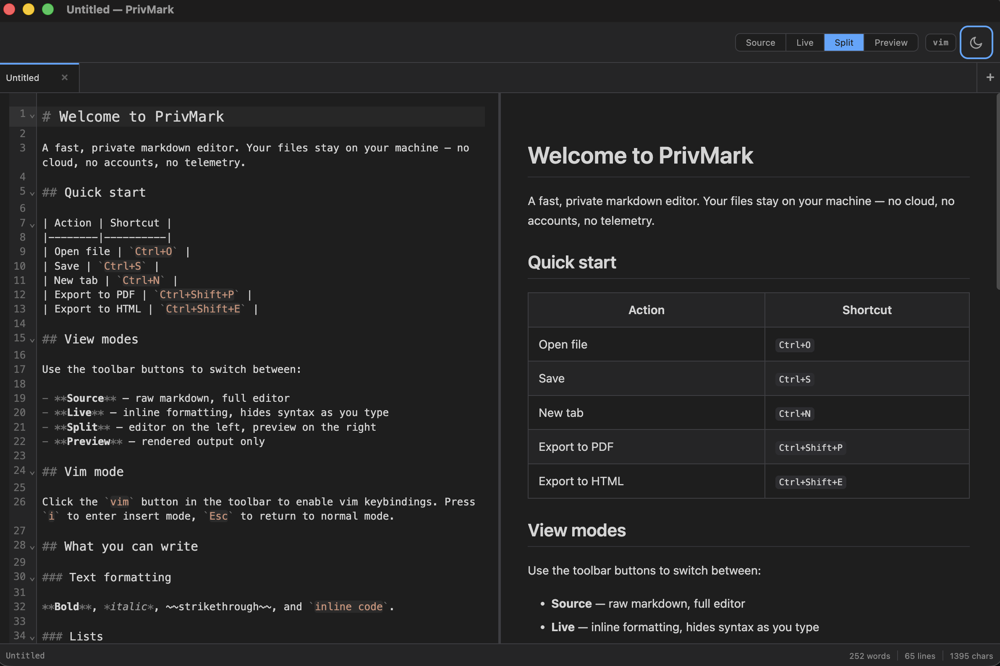

# PrivMark

**A fast, beautiful markdown editor with dark mode and live preview.**

The markdown editor for writers who care about speed, privacy, and beautiful design.

**macOS:**

---

## Features

**Write markdown. See it rendered. Instantly.**

- **Split-pane editing** — raw markdown on the left, live preview on the right
- **Four view modes** — Source, Live, Split, and Preview
- **Dark mode** — one-click toggle, remembers your preference, matches your system
- **Syntax highlighting** — 180+ languages via highlight.js
- **Custom editor theme** — CodeMirror 6 with matched light and dark themes
- **Status bar** — live word count, line count, character count, reading time
- **Native file dialogs** — open and save `.md` files like a real desktop app
- **File tree sidebar** — open a folder, browse and switch files
- **Outline panel** — heading tree with click-to-jump navigation
- **Quick Open** — `Ctrl+P` fuzzy file finder
- **Font size shortcuts** — `Ctrl+=`/`Ctrl+-` or `Ctrl+Scroll` to adjust document font size
- **File change detection** — auto-reloads when files change on disk (e.g., git checkout)
- **Explorer integration** — right-click a folder → "Open in PrivMark" (Windows)
- **GFM support** — strikethrough, tables, task lists, auto-linking
- **LaTeX math** — inline `$x$` and block `$$x$$` via KaTeX
- **Mermaid diagrams** — fenced code blocks rendered as diagrams
- **Find & Replace** — `Ctrl+F` / `Ctrl+H` with regex support
- **Auto-update** — new versions delivered automatically, no manual downloads
- **Cross-platform** — Windows (x64, ARM64), macOS (Intel, Apple Silicon), and Linux (x64, ARM64)

**macOS dark mode:**

---

## Install

### VS Code Extension

Install from the [Visual Studio Marketplace](https://marketplace.visualstudio.com/items?itemName=Wolfberry.privmark-markdown-editor) or search "PrivMark" in the Extensions panel (`Ctrl+Shift+X`).

### Windows

| Installer | Description |
|-----------|-------------|
| [**PrivMark-Setup-x64.exe**](https://github.com/wolfberry-ab/privmark/releases/latest) | Recommended — wizard installer with desktop shortcut (Intel/AMD) |
| [**PrivMark-Setup-arm64.exe**](https://github.com/wolfberry-ab/privmark/releases/latest) | Wizard installer for ARM64 |
| [**PrivMark-win32-x64.zip**](https://github.com/wolfberry-ab/privmark/releases/latest) | Portable — no installation needed (Intel/AMD) |

### Linux

| Package | Description |
|---------|-------------|
| [**PrivMark-linux-x64.zip**](https://github.com/wolfberry-ab/privmark/releases/latest) | x64 (Intel/AMD) |
| [**PrivMark-linux-arm64.zip**](https://github.com/wolfberry-ab/privmark/releases/latest) | ARM64 (Raspberry Pi 4+) |
| [**.deb / .rpm**](https://github.com/wolfberry-ab/privmark/releases/latest) | Native packages for Debian/Ubuntu and Fedora/RHEL |

### macOS

| Package | Description |
|---------|-------------|
| [**PrivMark-darwin-x64.zip**](https://github.com/wolfberry-ab/privmark/releases/latest) | Intel Mac |
| [**PrivMark-darwin-arm64.zip**](https://github.com/wolfberry-ab/privmark/releases/latest) | Apple Silicon (M1/M2/M3/M4) |

> macOS builds are currently unsigned. Right-click the app → Open to bypass Gatekeeper on first launch.

> All releases include SHA256 checksums. [Verify your download](https://github.com/wolfberry-ab/privmark/releases/latest).

---

## Why PrivMark?

| | PrivMark |
|---|---|
| **Price** | **Free forever** (optional Pro upgrade for AI features) |
| **Works offline** | Always — no account, no cloud, no internet required |
| **Dark mode** | Built-in with one-click toggle |
| **Split pane** | Source + preview side by side |
| **Real markdown files** | Your files, plain `.md`, no proprietary format |
| **AI writing (coming)** | Built-in, with local model support for full privacy |
| **Privacy** | No analytics, no tracking. Update checks via GitHub may expose your IP to GitHub's CDN |
| **Auto-update** | New versions delivered seamlessly |
| **Active development** | Regular updates, public changelog |

---

## Coming Soon

**AI-assisted writing** — built into the editor, not bolted on.

- **Continue writing** — hit a shortcut, AI writes the next paragraph in your style
- **Rewrite selection** — make it shorter, more formal, or clearer
- **Fix grammar** — one-click proofread without leaving the app
- **Smart tables** — describe a table in plain English, get formatted markdown
- **Local AI support** — run models on your machine, your text never leaves your computer

> The editor is free forever. AI-powered Pro features coming soon ($9 one-time).

---

## Privacy & Security

PrivMark is built by [Wolfberry AB](https://wolfberry.se), a security-focused Swedish software company.

- **No telemetry** — no analytics, no tracking, no data collection
- **No account required** — download, install, write
- **No cloud dependency** — everything runs locally on your machine
- **Local AI option** — when AI features ship, you can use local models (Ollama) instead of cloud APIs
- **Your files, your machine** — we never see your documents

---

## Tech Stack

Built with modern, proven technology:

- **Electron 40** — native desktop performance
- **React 19** — fast, responsive UI
- **CodeMirror 6** — the best code editor component
- **markdown-it** — fast, spec-compliant markdown parsing
- **highlight.js** — syntax highlighting for 180+ languages

---

## Changelog

See [Releases](https://github.com/wolfberry-ab/privmark/releases) for the full changelog.

---

## Feedback & Support

- **Bug reports:** [Open an issue](https://github.com/wolfberry-ab/privmark/issues)
- **Feature requests:** [Open an issue](https://github.com/wolfberry-ab/privmark/issues)
- **Email:** hello@privmark.app

---

Made with care by [Wolfberry AB](https://wolfberry.se) in Sweden.

Copyright 2026 Wolfberry AB. All rights reserved.

